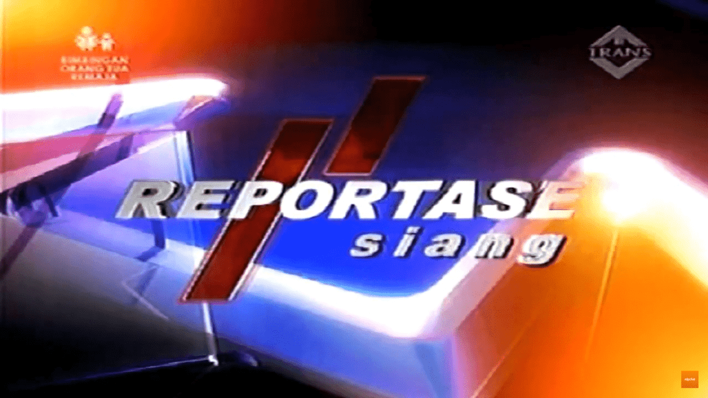

# Dokumentasi ku dan kita
Tidak bisa dipungkiri kalau dokumentasi untuk diri dan kita

## Bagimana dengan dokumentasi yang bahasa Indonesia?
Di sini hanya untuk dokumentasi untuk dokumentasi yang awam

## Lalu mengapa bahasa Indonesia beda dengan bahasa Melayu?
Melayu yang aksen beda. Indonesia tetap Indonesia, sekalipun
bahasa yang "mirip" ya "beda". Kita mencoba memahami
masyarakat Indonesia. Nah, agak sedikit tambahan kalau
bahasa Indonesia mungkin bisa fleksibel, contoh aja teks yang
ciri khas Ma'had Al Zaytun:
> ... akan dilaksanakan pada tarikh 7 Juni 2002 / 19 Sya'ban 1423
> sampai 19 Juni 2001 / 29 Sya'ban 1423 ...

Sekilas saja sudah bisa bahasa Indonesia "sangat fleksibel"

Ada lagi yang biasanya di Genshin Impact:
> Macam apa ini?
>
> _Paimon (Genshin Impact)_

Penerjemah kalangan gamers. Yang paling khas adalah cara
komunikasi.

## Ini adalah untuk dasar
...
> Trailblazer melihat Herta yang diam, ingin sapa dulu.
> Herta sedang sibuk. Coba lain kali.  
> _Dengar: Kurukurukuru - kururing (MEME JP VOICE BASED)_
> 
> _Herta (Honkai: Star Rail)_

===

 "Reportase Siang Trans TV 2010"
_CONTOH GAMBAR_
Sumber: Dokumentasi Trans TV melalui [rcpch id @ Youtube](https://youtu.be/IfG6GSCvLNA?t=10)